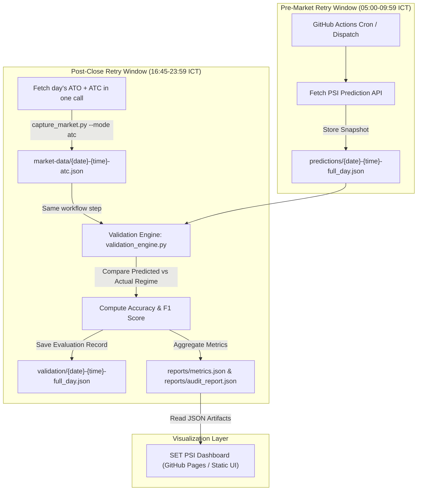

# SET PSI Validation: Intraday Execution & Truth Layer Flow

This document defines the end-to-end intraday execution cycle, data ingestion, and validation flow for the **SET PSI Validation** ecosystem using a Mermaid architecture diagram.

## 1. Intraday Execution & Validation Flowchart

---

## 2. Core Operational Rules

1. **No Lookahead Bias:** Prediction capture must complete before the 10:00 ICT market open (ATO).
2. **Single Daily Cycle:** One `full_day` prediction, one post-close ATC capture (ATO and ATC fetched together), one validation per trading day (RFC 020). Retries are idempotent: a date with a complete ATC record is skipped.
3. **Deterministic Truth Layer:** Market outcomes are derived purely from verified price action and rolling volatility calculations, serving as an objective audit benchmark for PSI predictions.
