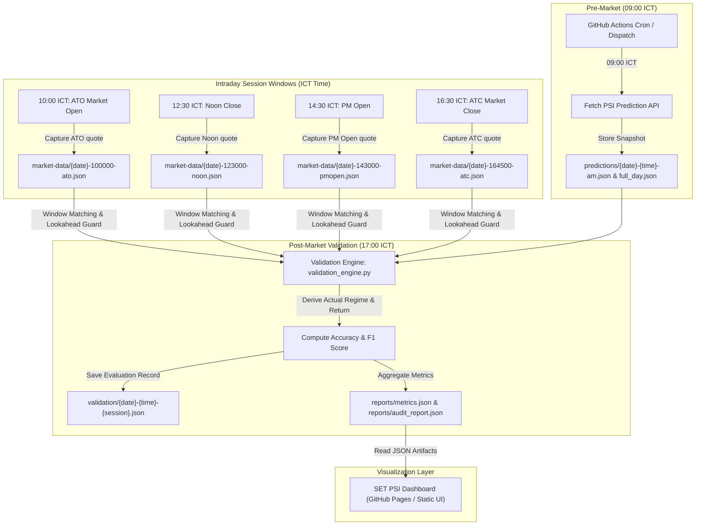

# SET PSI Validation: Intraday Execution & Truth Layer Flow

This document defines the end-to-end intraday execution cycle, data ingestion, and validation flow for the **SET PSI Validation** ecosystem using a Mermaid architecture diagram.

## 1. Intraday Execution & Validation Flowchart

---

## 2. Core Operational Rules

1. **No Lookahead Bias:** Prediction capture (Pre-ATO at 09:00) must occur strictly before market opening quotes (ATO at 10:00) are recorded.
2. **Four-Session Granularity:** The pipeline captures and validates across four intraday windows (ATO, Noon, PM Open, ATC) to evaluate regime consistency throughout the trading day.
3. **Deterministic Truth Layer:** Market outcomes are derived purely from verified price action and rolling volatility calculations, serving as an objective audit benchmark for PSI predictions.
