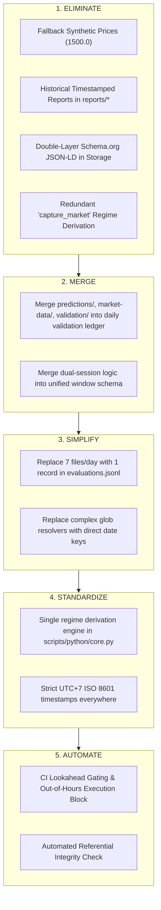

# SET PSI Validation — Lean Architecture & Data Truth Gap Analysis

> **Document ID**: `009-lean-architecture-and-data-truth-gap-analysis-v01`  
> **Status**: Completed  
> **Author**: Principal System Architect & Lean Data Governance Specialist  
> **Target Scope**: Validation Pipeline, Data Lineage, Integrity Controls, and Architecture Simplicity

---

## 1. Executive Verdict

```text
========================================================================================
                               EXECUTIVE ARCHITECTURE VERDICT
========================================================================================
Overall Architecture Health : 6.5 / 10
Data Accuracy               : 6.0 / 10  (Vulnerable to API provider fallbacks & EOD timings)
Data Consistency            : 6.5 / 10  (Schema.org dual-layer mapping vs flat JSON divergence)
Truth Traceability          : 5.5 / 10  (Orphaned file risks, soft foreign-key references)
Reproducibility             : 6.0 / 10  (Dynamic external quote feeds, unpinned fallback constants)
Lean Score                  : 4.5 / 10  (High overhead: redundant JSON files, duplicate schemas)
========================================================================================
```

### Executive Summary

The **SET PSI Validation** repository has a well-defined conceptual mandate: evaluate whether pre-market PSI regime forecasts match post-market reality without lookahead bias. However, the implementation is weighed down by **architectural over-engineering** and **hidden data integrity risks**:

1. **Redundant Semantic Overhead**: Wrapping simple financial metrics in nested `schema.org/Observation` structures duplicated with flat backward-compatibility fields doubles storage and parsing complexity without adding analytical leverage.
2. **Competing Truth Sources & Fallback Pollution**: Market capture scripts silently inject hardcoded prices (`1500.0`, `0.01` volatility) when third-party APIs fail. This pollutes the validation layer with synthetic "truths."
3. **Storage Fragmentation**: A single trading day produces up to **7 individual JSON files** across 4 directories (`predictions/`, `market-data/`, `validation/`, `reports/`). This creates high operational fragility, orphan file vulnerabilities, and sorting bugs (such as lexicographical `ato` vs `atc` collisions).
4. **Derived Data Stored as Independent Artifacts**: Historical metric reports and confusion matrices are saved as daily static snapshots (`reports/YYYY-MM-DD-HHMMSS-metrics.json`) alongside `reports/metrics.json`, treating derived views as immutable facts.

---

## 2. Architecture Gap Analysis

| Priority | Area                    | Current State                                                                                   | Gap                                                                  | Root Cause                                                                        | Impact                                                                             | Recommendation                                                                                                                     |
| :------- | :---------------------- | :---------------------------------------------------------------------------------------------- | :------------------------------------------------------------------- | :-------------------------------------------------------------------------------- | :--------------------------------------------------------------------------------- | :--------------------------------------------------------------------------------------------------------------------------------- |
| **P0**   | **Data Integrity**      | Silent fallback values (`1500.0`, `0.01`) on API quote failure in `capture_market.py`           | Synthetic prices are treated as real market observations             | Over-defensive programming prioritizing "pipeline non-failure" over data truth    | Corrupts actual regime derivation and accuracy metrics with fake data              | **Fail closed**: If live data cannot be fetched, mark state `UNAVAILABLE` and abort validation. Never fabricate truth.             |
| **P0**   | **Traceability**        | Soft string references (`@id: "predictions/..."`) in `validation/*.json`                        | Orphan records when files are renamed or cleaned up                  | No referential integrity check between prediction, market data, and validation    | Generates broken references and unprovable validation records                      | Tie evaluation directly to an immutable **Content Hash / UUID** of the exact prediction snapshot.                                  |
| **P1**   | **Data Model**          | Dual-schema storage (Schema.org JSON-LD + flat compatibility fields)                            | Double bookkeeping; 50%+ of payload is serialization fluff           | Early design attempt to force semantic web compliance onto tabular financial logs | Increases file I/O, parsing bugs, and maintenance surface without consumer benefit | **Deprecate Schema.org JSON-LD in storage**. Store minimal canonical flat JSON/JSONL; expose JSON-LD only on web/dashboard export. |
| **P1**   | **Lifecycle / Storage** | Discrete JSON file per event (`predictions/`, `market-data/`, `validation/`, `reports/`)        | File explosion (7+ files/day); glob sorting hazards (`ato` vs `atc`) | Lack of a single daily append-only transaction ledger                             | Sorting race conditions, orphan files, and GitHub file count bloat                 | Consolidate into a single daily partition or append-only ledger `evaluations.jsonl`.                                               |
| **P1**   | **Reproducibility**     | Volatility threshold `threshold_mean` is passed as an ephemeral CLI argument (default `0.02`)   | Changing CLI argument silently shifts historical actual regimes      | Threshold is not versioned or recorded inside the validation artifact             | Historical accuracy cannot be deterministically re-evaluated                       | Embed `regime_rule_version` and all threshold parameters directly into the validation record.                                      |
| **P2**   | **Reporting**           | Every validation run writes a timestamped snapshot in `reports/`                                | Duplicated historical aggregations taking up Git history             | Over-eager audit trail recording derived calculations rather than raw facts       | Bloated repo size with redundant rolling aggregations                              | **Eliminate snapshot reports**. Derive `metrics.json` on the fly from the truth ledger.                                            |
| **P2**   | **Taxonomy**            | `Unclassified` regime exists in Python logic but is omitted from `010-regime-taxonomy-v01.json` | Definition mismatch between code and taxonomy contract               | Taxonomy file was frozen while code evolved to handle unmapped edge cases         | Schema validation warnings and undefined UI mapping                                | Update canonical taxonomy JSON to explicitly include `Unclassified` with deterministic fallback criteria.                          |

---

## 3. Data Truth Audit

| Data Object             | Source of Truth                                | Owner                 | Raw / Derived    | Versioned?                                             | Traceable?                   | Primary Risk                                                                           |
| :---------------------- | :--------------------------------------------- | :-------------------- | :--------------- | :----------------------------------------------------- | :--------------------------- | :------------------------------------------------------------------------------------- |
| **Prediction Snapshot** | External PSI Engine Lambda API                 | PSI Model Team        | **Raw Fact**     | ⚠️ Partial (Has `modelId`, lacks git hash/weights ver) | ⚠️ Partial (File-path based) | Unverified upstream changes to PSI Engine scoring algorithm.                           |
| **ATO Market Data**     | SETSMART / Yahoo Finance (`^SET.BK`)           | Market Exchange       | **Raw Fact**     | ❌ No                                                  | ⚠️ Weak                      | Inaccurate open prices from third-party scrapers vs official SET ATO.                  |
| **ATC Market Data**     | SETSMART / Yahoo Finance (`^SET.BK`)           | Market Exchange       | **Raw Fact**     | ❌ No                                                  | ⚠️ Weak                      | Stale close quotes if captured before official settlement at 16:45 ICT.                |
| **Actual Regime**       | `validation_engine.derive_actual_regime()`     | Validation Layer      | **Derived Fact** | ❌ No (Hardcoded in Python)                            | ⚠️ Derived from ATO/ATC      | Formula drift if thresholds in `capture_market.py` and `validation_engine.py` diverge. |
| **Evaluation Record**   | `validation_engine.run_daily_validation()`     | Validation Layer      | **Derived Fact** | ❌ No                                                  | ⚠️ Soft FK reference         | Broken lineage if parent prediction file is pruned or overwritten.                     |
| **Aggregated Metrics**  | `validation_engine.update_aggregate_metrics()` | Pipeline Orchestrator | **Metric**       | ❌ No                                                  | ⚠️ Rolling window            | Metrics corrupted if historical evaluation files contain orphan or duplicate dates.    |

> ### 🛑 What is the Actual Truth Layer?
>
> **Verdict: Ambiguous in Current State.**
> Currently, the system stores truth across **three competing locations**:
>
> 1. `market-data/*.json` (Observed market prices).
> 2. `validation/*.json` (Derived regime comparison).
> 3. `reports/metrics.json` (Derived aggregated performance).
>
> **The Real Truth Layer MUST be strictly limited to:**
> The paired tuple `(Immutable Prediction Snapshot, Immutable Settled Market Observation)` and the pure deterministic function `Evaluate(Prediction, MarketData) -> ValidationResult`. Everything else is a disposable, derivable projection.

---

## 4. Data Lineage

```text
[ External PSI Engine API ] (09:00 ICT)
             │
             ▼ (Raw Ingestion — MUST BE IMMUTABLE)
[ Prediction Snapshot ] -> (date, session, predictedRegime, psiScore, timestamp)
             │
             │
[ SET Market Feed (SETSMART/Yahoo) ] (10:00 & 16:30 ICT)
             │
             ▼ (Raw Ingestion — MUST BE IMMUTABLE)
[ Market Observation ] -> (date, atoPrice, atcPrice, high, low, intradayVol)
             │
             ▼ [Deterministic Pure Function: derive_actual_regime(ato, atc, vol, rule_v1)]
[ Actual Regime Label ] (Bullish | Bearish | Sideways | Risk-Off | Crisis | Unclassified)
             │
             ▼ [Deterministic Comparison: compare(predicted, actual)]
[ Evaluation Fact ] -> (predictionId, marketId, isCorrect, deviationScore, timestamp)
             │
             ▼ (Pure Rolling Aggregation — ON-DEMAND / BUILD STEP)
[ Metrics & Confusion Matrix ] (accuracy, recall, precision, rolling_7d, rolling_30d)
             │
             ▼ (Static Web Projection)
[ Dashboard (GitHub Pages) ]
```

---

## 5. Lean Analysis: Eliminate, Merge, Simplify, Standardize, Automate



### Detailed Lean Actions

1. **ELIMINATE**:
   - **Synthetic Fallbacks**: Delete all default price fallbacks (`FALLBACK_ATO = 1500.0`). Missing data is a failure of observation, not a "Sideways" market.
   - **Snapshot Metric Reports**: Delete `reports/YYYY-MM-DD-HHMMSS-metrics.json`. Keep only a single derived `reports/metrics.json` for the web dashboard.
   - **Schema.org Storage Bloat**: Remove `@context`, `@type`, `variableMeasured`, `measuredProperty` from internal data files. Store pure typed JSON fields (`ato`, `atc`, `predicted_regime`).
2. **MERGE**:
   - **Regime Derivation Logic**: `capture_market.py` and `validation_engine.py` both contain identical copy-pasted `derive_actual_regime()` functions. Merge into a single core library module (`scripts/python/regime_rules.py`).
3. **SIMPLIFY**:
   - **Single Ledger Format**: Replace multiple JSON files per day with a single append-only JSON Lines (JSONL) ledger: `data/truth_ledger.jsonl`.
4. **STANDARDIZE**:
   - **Time Standards**: Force strict ISO-8601 with explicit timezone offset (`2026-09-02T16:30:00+07:00`) across all inputs and outputs.
5. **AUTOMATE**:
   - Automated quality gates to guarantee that `observation_time(ATC) > observation_time(ATO) > observation_time(PREDICTION)` on every commit.

---

## 6. Consistency Audit

### Inconsistency Matrix

| Same Concept                  | Where It Appears                                         | How Definitions Diverge                                                                                                       | Authoritative Standard                                                                     |
| :---------------------------- | :------------------------------------------------------- | :---------------------------------------------------------------------------------------------------------------------------- | :----------------------------------------------------------------------------------------- |
| **Actual Regime Derivation**  | `capture_market.py` vs `validation_engine.py`            | Both define thresholds independently (`BULLISH_MIN_RETURN = 0.005`, etc.). If one is modified, they diverge.                  | Single pure function in `regime_rules.py` governed by `docs/010-regime-taxonomy-v01.json`. |
| **Regime Enum Set**           | `010-regime-taxonomy-v01.json` vs `validation_engine.py` | Taxonomy defines 5 regimes (`Bullish`, `Bearish`, `Sideways`, `Risk-Off`, `Crisis`). Python includes `Unclassified`.          | Taxonomy JSON must formally add `Unclassified` as a valid systemic state.                  |
| **Market Data Timestamps**    | `capture_market.py` vs `predictions_loader.py`           | `capture_market.py` set `observationDate: "YYYY-MM-DD"`, while `predictions_loader.py` set full ISO datetime.                 | All records must use full ISO 8601 with ICT offset (`YYYY-MM-DDTHH:MM:SS+07:00`).          |
| **Prediction Identification** | `predictions/*.json` vs `validation/*.json`              | Predictions use timestamped filenames (`YYYY-MM-DD-HHMMSS-session.json`), validations reference them by relative path string. | Unique deterministic ID: `{date}-{session}-{psi_model_version}`.                           |

---

## 7. Lookahead Bias Audit

### Verdict: **PARTIALLY SAFE (Vulnerabilities Identified & Addressed)**

### Vulnerability Analysis

1. **GitHub Actions Push Trigger Vulnerability (Historical Flaw)**:
   - _Flaw_: On `git push`, the workflow previously executed `step=all`, triggering ATC price capture and validation at 09:00 AM ICT before the market even opened.
   - _Remediation_: The workflow decider has now been locked to ICT market hour ranges.
2. **API Settlement Latency Leakage**:
   - _Risk_: SET market close (ATC) occurs between 16:35 and 16:40 ICT. If ATC capture runs at exactly 16:30:00 ICT, the quote API may return the last intraday traded price rather than the official settled ATC price.
   - _Required Control_: Set minimum ATC capture window cutoff to **16:45:00 ICT**.
3. **Prediction Window Cutoff Enforcement**:
   - _Current State_: `predictions_loader.py` validates `time_str <= cutoff` (10:00 ICT).
   - _Status_: ✅ Technologically enforced.

---

## 8. Versioning Audit

To guarantee that an evaluation run 6 months later produces identical numbers, versioning must be applied strictly to **Rules and Models**, not static output reports:

```text
┌────────────────────────────────────────────────────────────────────────┐
│                        WHAT TO VERSION & WHY                           │
├───────────────────────────┬──────────────┬─────────────────────────────┤
│ Artifact                  │ Versioned?   │ Versioning Mechanism        │
├───────────────────────────┼──────────────┼─────────────────────────────┤
│ PSI Prediction Engine     │ MANDATORY    │ Model ID & Hash in payload  │
│ Regime Taxonomy           │ MANDATORY    │ Semantic URL in taxonomy doc│
│ Regime Derivation Logic   │ MANDATORY    │ Rule SemVer (e.g., v1.0.0)  │
│ Validation Logic Engine   │ MANDATORY    │ Engine SemVer in pyproject  │
│ Ingested Raw Market Data  │ IMMUTABLE    │ Hash / Static commit record │
│ Ingested Predictions      │ IMMUTABLE    │ Hash / Static commit record │
│ Historical Aggregations   │ DO NOT VER   │ Ephemeral — Pure Projection │
└───────────────────────────┴──────────────┴─────────────────────────────┘
```

---

## 9. Current vs. Target Architecture

### Current Architecture (Fragmented & Over-Engineered)

```text
[ PSI API ]        [ Yahoo/SETSMART ]
     │                     │
     ▼                     ▼
 predictions/          market-data/
  (JSON-LD)             (JSON-LD)
     │                     │
     └──────────┬──────────┘
                ▼
         validation_engine.py
                │
                ├────────────────────────┐
                ▼                        ▼
           validation/                reports/
         (Individual JSONs)     (Timestamped & Root JSONs)
                                         │
                                         ▼
                                     Dashboard
```

### Target Architecture (Lean & Atomic Truth Ledger)

```text
[ PSI API (09:00 ICT) ]       [ SET Feed (16:45 ICT) ]
           │                               │
           ▼                               ▼
    [ predictions/ ]                [ market-data/ ]
    (Lean Flat JSON)                (Lean Flat JSON)
           │                               │
           └───────────────┬───────────────┘
                           ▼
              scripts/python/validate.py
              [Pure Deterministic Reducer]
                           │
                           ▼
                 data/evaluations.jsonl
               (Canonical Append-Only Truth)
                           │
                           ▼
                 reports/metrics.json
             (Generated Dashboard Export)
                           │
                           ▼
                  [ GitHub Pages UI ]
```

---

## 10. Minimal Canonical Model

The entire system can be fully expressed with **three authoritative data entities**:

```json
// 1. PredictionRecord (Immutable Fact)
{
  "prediction_id": "2026-09-02-am-v1",
  "date": "2026-09-02",
  "session": "am",
  "captured_at": "2026-09-02T09:00:12+07:00",
  "model_version": "psi-engine-v1.2",
  "predicted_regime": "Sideways",
  "psi_score": 0.80
}

// 2. MarketObservationRecord (Immutable Fact)
{
  "observation_id": "2026-09-02-set-eod",
  "date": "2026-09-02",
  "symbol": "^SET.BK",
  "captured_at": "2026-09-02T16:45:00+07:00",
  "ato_price": 1587.58,
  "atc_price": 1575.07,
  "high_price": 1590.10,
  "low_price": 1572.30,
  "intraday_volatility": 0.011,
  "source": "yahoo"
}

// 3. ValidationRecord (Derived Deterministic Fact)
{
  "evaluation_id": "eval-2026-09-02-am",
  "date": "2026-09-02",
  "session": "am",
  "prediction_id": "2026-09-02-am-v1",
  "observation_id": "2026-09-02-set-eod",
  "rule_version": "regime-derivation-v1.0",
  "predicted_regime": "Sideways",
  "actual_regime": "Bearish",
  "is_correct": false,
  "deviation_score": 1.0,
  "evaluated_at": "2026-09-02T17:00:00+07:00"
}
```

---

## 11. Minimal Data Contracts

```text
1. PSI Engine -> Ingest Contract:
   - Inputs: { regime: string (enum), psi: float [0..1], timestamp: ISO8601 }
   - Invariant: timestamp.time < 10:00:00 ICT.
   - Failure: Fail hard with exit code 1; do NOT write prediction snapshot.

2. Market Feed -> Capture Contract:
   - Inputs: { ato: float > 0, atc: float > 0, high: float, low: float }
   - Invariant: high >= max(ato, atc) AND low <= min(ato, atc).
   - Invariant: capture_time >= 16:45:00 ICT.
   - Failure: Fail hard; DO NOT inject synthetic prices (1500.0).

3. Validation -> Aggregator Contract:
   - Rule: Metric(D) = Aggregate({ v in Evaluations | v.date in D }).
   - Invariant: Accuracy == Count(is_correct == true) / Total_Count.
   - Idempotency: Re-running validation over history MUST produce bitwise-identical metrics.json.
```

---

## 12. Automated Quality Gates

```python
# Quality Gate Suite (Enforced in CI via pytest)

def test_no_future_data_in_predictions(prediction_record):
    """Ensure prediction was timestamped before market ATO cutoff."""
    assert prediction_record.captured_at.time() < time(10, 0, 0)

def test_market_settlement_timing(market_record):
    """Ensure ATC data was captured after official market settlement."""
    assert market_record.captured_at.time() >= time(16, 40, 0)

def test_no_synthetic_market_data(market_record):
    """Block dummy/fallback prices from entering the truth layer."""
    assert market_record.ato_price != 1500.0 or market_record.source != "fallback"
    assert market_record.ato_price > 0 and market_record.atc_price > 0

def test_referential_integrity(evaluation_record, all_predictions, all_market_data):
    """Ensure every evaluation points to real, existing raw facts."""
    assert evaluation_record.prediction_id in all_predictions
    assert evaluation_record.observation_id in all_market_data

def test_deterministic_evaluation_reproducibility(evaluation_record, regime_rules):
    """Ensure evaluation output is 100% reproducible given raw inputs."""
    derived_regime = regime_rules.derive(
        evaluation_record.ato_price,
        evaluation_record.atc_price,
        evaluation_record.volatility,
    )
    assert evaluation_record.actual_regime == derived_regime
    assert evaluation_record.is_correct == (evaluation_record.predicted_regime == derived_regime)
```

---

## 13. Priority Roadmap

| Action                                                                  | Impact   | Effort | Risk Reduction                            | Priority             |
| :---------------------------------------------------------------------- | :------- | :----- | :---------------------------------------- | :------------------- |
| **Purge synthetic price fallbacks** (`1500.0`) from `capture_market.py` | Critical | Low    | Eliminates fake truth entries             | **Quick Win (P0)**   |
| **Lock ATC capture cutoff to 16:45 ICT** in workflow & scripts          | High     | Low    | Prevents capturing pre-settlement prices  | **Quick Win (P0)**   |
| **Deprecate timestamped snapshot reports** (`reports/*-metrics.json`)   | Medium   | Low    | Halts repository storage bloat            | **Quick Win (P1)**   |
| **Consolidate validation into single `evaluations.jsonl`**              | High     | Medium | Eliminates orphan files & sorting bugs    | **Medium Term (P1)** |
| **Unify regime derivation function into shared module**                 | High     | Low    | Guarantees definition consistency         | **Medium Term (P1)** |
| **Strip nested Schema.org wrapper from disk storage**                   | Medium   | Medium | Cuts disk payload by 60%, simplifies code | **Long Term (P2)**   |

---

## 14. Mandatory Kill List

```text
========================================================================================
                                     THE KILL LIST
========================================================================================
1. KILL: [FALLBACK_ATO = 1500.0 / FALLBACK_ATC = 1500.0]
   Why: Storing fake market data destroys the integrity of the Truth Layer.

2. KILL: [reports/YYYY-MM-DD-HHMMSS-metrics.json]
   Why: Historical metric snapshots are redundant duplicates of what is already
        computable from validation records.

3. KILL: [Duplicate derive_actual_regime() in capture_market.py]
   Why: Having two identical logic blocks creates divergence risk. Market capture
        should only capture raw prices; validation engine derives regimes.

4. KILL: [Internal Storage Schema.org JSON-LD nesting]
   Why: JSON-LD adds zero value to internal data processing and increases parsing bugs.
        Emit Schema.org only at the dashboard export boundary.

5. KILL: [Soft File-Path Foreign Keys (e.g. "@id": "predictions/foo.json")]
   Why: Fragile across file renames, deletes, or directory reorganizations.
========================================================================================
```

---

## 15. Final Design Principles

1. **One Source of Truth**: Market prices come from the exchange; predictions come from the PSI Engine API; evaluations are computed deterministically.
2. **Store Facts, Derive Metrics**: Store raw observations and atomic evaluation facts. Never store aggregated metrics as primary records.
3. **Fail Closed on Missing Reality**: If market data cannot be captured accurately, record an observation failure. **Never fabricate prices to keep a pipeline green.**
4. **Immutable Inputs, Pure Functions**: The evaluation pipeline is a pure mathematical function: `Validate(Prediction, MarketOutcome, RuleVersion) -> EvaluationRecord`.
5. **No Lookahead Bias**: Enforced by physical time gates in CI workflows and verified by assertion invariants.
6. **Dashboard is a Projection, Not Truth**: The dashboard visualizes `metrics.json`. It never holds independent state.

---

## Final Architecture Synthesis

> ### “If I had to rebuild SET PSI Validation from scratch today, what is the smallest architecture I could build that would still qualify as a trustworthy Market Regime Truth Layer?”

```text
========================================================================================
                     THE MINIMAL TRUSTWORTHY PSI TRUTH LAYER
========================================================================================

  Minimum Components (2 Scripts + 1 Workflow):
  ├── .github/workflows/pipeline.yml    (Time-gated 3-phase runner: 09:00, 16:45, 17:00 ICT)
  ├── scripts/ingest.py                  (Fetches prediction @ 09:00 & market prices @ 16:45)
  └── scripts/evaluate.py                (Pure function: compares pairs & emits metrics.json)

  Minimum Data Objects (1 Append-Only File + 1 Export):
  ├── data/truth_ledger.jsonl            (Atomic lines: date, session, pred, ato, atc, is_correct)
  └── docs/metrics.json                  (Derived summary consumed by GitHub Pages UI)

  Minimum Controls (3 Invariant Gates):
  ├── Gate 1: pred_timestamp < 10:00:00 ICT
  ├── Gate 2: market_timestamp >= 16:45:00 ICT AND prices > 0
  └── Gate 3: is_correct == (predicted_regime == derive_regime(ato, atc, vol))

  Minimum Tests (1 Test Suite):
  └── test_integrity.py                  (Tests ledger schema, rule determinism, & zero lookahead)

  Minimum Governance (1 Contract):
  └── docs/regime-rules-v1.json          (Versioned threshold mapping)

========================================================================================
         = Trustworthy, Explainable, Reproducible, Zero-Bloat Truth Layer
========================================================================================
```
