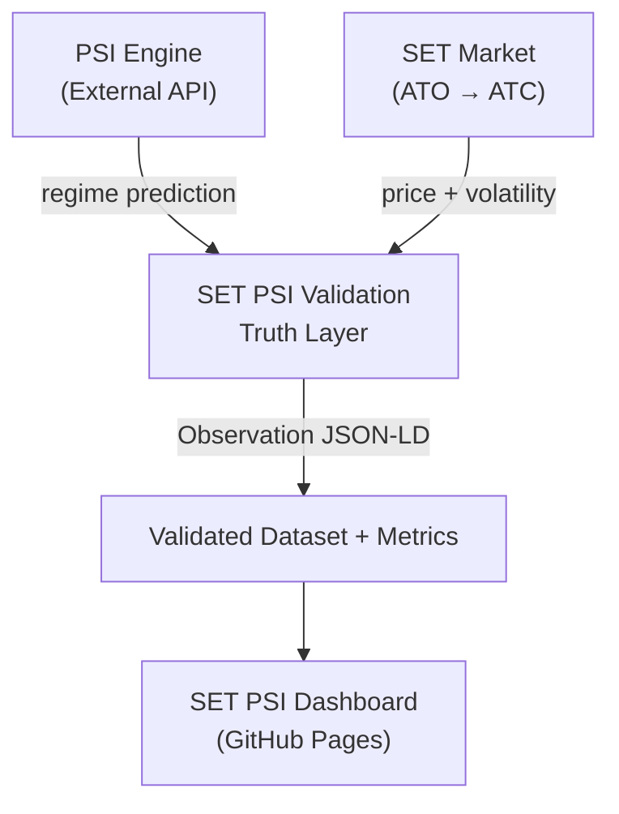
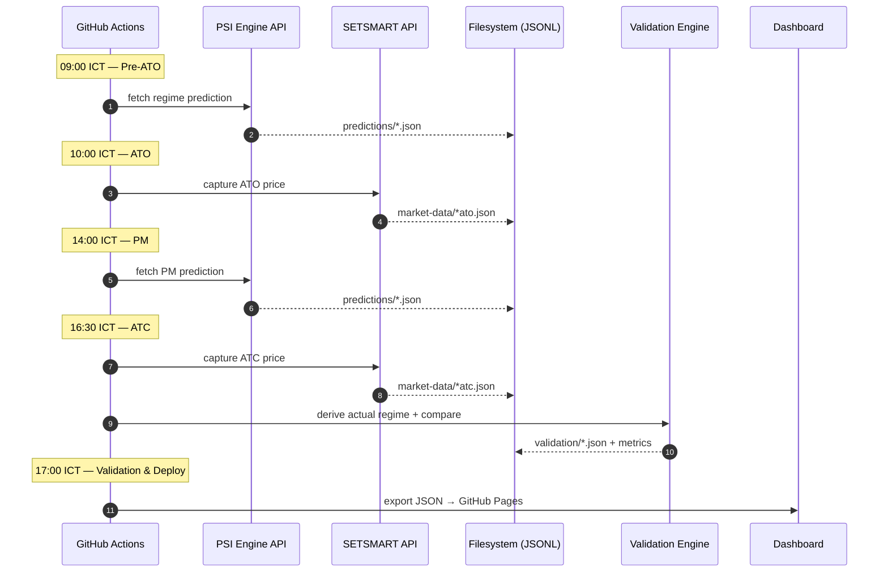

# PSI System Flow (SET Market)

This document describes the end-to-end flow of the PSI (Pressure-Signal Index) ecosystem, from prediction generation to validation and visualization.

The system is designed to evaluate **market regime prediction accuracy**, not price prediction.

---

## 1. High-Level Architecture Flow



---

## 2. Daily Execution Flow (Intraday Cycle)

The system runs once per trading day based on the SET market schedule.

---

### Step 1 — Pre-Market (Before ATO)

```text id="step1"
Time: ~09:00 ICT
```

Actions:

* Call PSI Engine API
* Fetch market regime prediction
* Generate PSI score (0.0 – 1.0)
* Store prediction snapshot

Output:

```json id="p1"
{
  "timestamp": "09:00",
  "predicted_regime": "BULLISH",
  "psi_score": 0.78
}
```

---

### Step 2 — Market Open (ATO)

```text id="step2"
Time: 10:00 ICT (approx.)
```

Actions:

* Capture opening price (ATO)
* Initialize intraday tracking

Data:

* SET index open level
* Market breadth snapshot (optional)

---

### Step 3 — Intraday Monitoring

```text id="step3"
Time: 10:00 → 16:30 ICT
```

Actions:

* Observe market behavior during session
* Track volatility and direction
* Prepare for regime classification

---

### Step 4 — Market Close (ATC)

```text id="step4"
Time: 16:30 ICT
```

Actions:

* Capture closing price (ATC)
* Compute intraday return
* Measure volatility

Output:

```json id="p2"
{
  "ato": 1450.20,
  "atc": 1438.10,
  "return_pct": -0.83
}
```

---

### Step 5 — Actual Regime Derivation

Actions:

* Convert intraday behavior into market regime label

Logic example:

* Strong positive return → Bullish
* Strong negative return → Bearish
* Low movement → Sideways
* High volatility + negative bias → Risk-Off
* Extreme move → Crisis

Output:

```json id="p3"
{
  "actual_regime": "RISK_OFF"
}
```

---

### Step 6 — Validation Layer

Actions:

* Compare predicted vs actual regime
* Compute correctness
* Store evaluation record

Output:

```json id="p4"
{
  "date": "2026-06-14",
  "predicted_regime": "RISK_OFF",
  "actual_regime": "RISK_OFF",
  "correct": true
}
```

---

### Step 7 — Metrics Aggregation

Actions:

* Update performance metrics
* Update rolling statistics (7D / 30D)
* Update confusion matrix

Metrics:

* Accuracy
* Precision / Recall
* F1 Score
* Regime hit rate

---

### Step 8 — Dashboard Update

Actions:

* Export aggregated JSON
* Update GitHub Pages data source
* Refresh visual charts

---

## 3. End-to-End Flow Summary



---

## 4. Data Artifacts

### Prediction Record

* PSI score
* Predicted regime
* Timestamp

---

### Market Record

* ATO price
* ATC price
* Return %
* Volatility proxy

---

### Validation Record

* Predicted regime
* Actual regime
* Correct / Incorrect flag

---

### Aggregated Metrics

* Accuracy (daily / rolling)
* Confusion matrix
* Regime distribution

---

## 5. Semantic Layer (Schema.org)

Every data artifact in this flow conforms to [schema.org](https://schema.org) types for semantic interoperability:

| Flow Step | Artifact | Schema.org Type | Key Property Mapping |
| :-------- | :------- | :-------------- | :------------------- |
| Step 1 (Prediction) | Pre-ATO forecast | `Observation` | `measurementMethod` = modelId, `variableMeasured` = psiScore |
| Step 2–4 (Market) | ATO/ATC data | `Observation` | `variableMeasured` = prices, return, volatility |
| Step 5 (Regime Derivation) | Actual regime | `DefinedTerm` | `inDefinedTermSet` = PSI Regime Taxonomy |
| Step 6 (Validation) | Comparison result | `Observation` | `observationAbout` links prediction & outcome, `marginOfError` = deviationScore |

Full mapping reference: [`docs/research_reports/008-schema-org-mapping-v01.md`](research_reports/008-schema-org-mapping-v01.md)

---

## 6. Core Principle

> PSI is evaluated only after it is exposed to reality.

This system enforces a strict separation between:

* Prediction (PSI Engine)
* Truth (Market outcome)
* Evaluation (Validation layer)
* Interpretation (Dashboard)

---

## 7. System Philosophy

* No lookahead bias
* No price prediction assumption
* Regime-based evaluation only
* Intraday (same-day) validation only

---

## 8. Final Structure View

```text id="final"
PSI Engine
    ↓
Pre-ATO Prediction
    ↓
SET Market (ATO → ATC)
    ↓
Reality Extraction
    ↓
SET PSI Validation
    ↓
Truth Dataset
    ↓
SET PSI Dashboard
```
